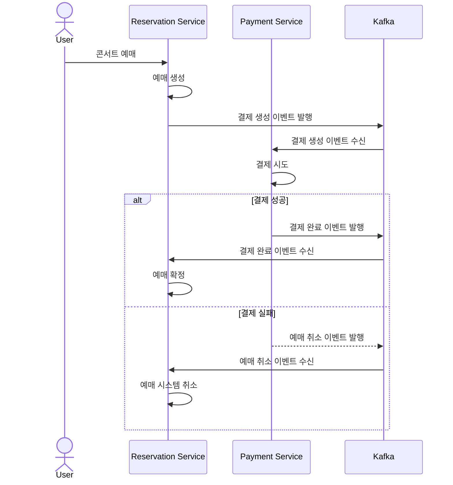

# SAGA 패턴 + Outbox 패턴

## 1. 프로젝트 소개
이 프로젝트는 콘서트 예매 시스템으로, MSA 아키텍처 기반에서 회원(User), 콘서트(Concert), 결제(Payment) 서비스로 분리되어 구성되어 있습니다.
이 프로젝트는 MSA 기반 콘서트 예매 시스템에서 Outbox 패턴으로 이벤트 전달의 신뢰성을 확보하고, Saga 패턴을 적용해 결제 실패 시 보상 트랜잭션을 통한 예약 롤백을 구현했습니다.

#### 주요 기능
- 사용자는 로그인 후 콘서트 예매를 할 수 있고, 예매시 결제가 동시에 이루어집니다.
- 콘서트 예매시 결제 처리중 오류가 발생할 경우 예매 내역은 자동으로 시스템 취소가 이루어지고, 콘서트 좌석은 이전 상태로 복구됩니다.
<br>

## 2. 예약 및 결제 프로세스
```text
[Concert Service]
  TX:
    - Reservation 생성 (PENDING)
    - Outbox에 PENDING_PAYMENT 저장
  COMMIT
        ↓ (Outbox Relay)
Kafka: concert-reserve
        ↓
[Payment Service]
  TX:
    - 결제 시도
    - Outbox에 Success / Fail 저장
  COMMIT
        ↓
Kafka: payment-success / payment-fail
        ↓
[Concert Service]
  TX:
    - 예약 CONFIRMED or SYSTEM_CANCELED (보상)
    - Outbox에 SUCCESS_PAYMENT or SYSTEM_CANCEL_PAYMENT 업데이트
```

- **Saga**: 예약 -> 결제 -> 보상
- **Outbox**: 각 단계의 이벤트 저장

<br>

## 3. 시퀀스 다이어그램
###  콘서트 예매 프로세스
---

### Description
콘서트 예매 이후 결제 처리 과정에 대한 시퀀스 다이어그램입니다.
- 사용자가 콘서트 예매를 요청하면, Reservation Service는 예매 정보를 생성하고 예매 상태를 결제 대기 상태로 저장합니다.
- 예매 생성이 완료되면, Reservation Service는 결제 생성을 위한 이벤트를 Kafka를 통해 발행합니다.
- Payment Service는 Kafka로부터 결제 생성 이벤트를 수신한 후 결제 처리를 시도합니다.
- 결제가 성공한 경우, Payment Service는 결제 완료 이벤트를 Kafka로 발행하고, Reservation Service는 해당 이벤트를 수신하여 예매 상태를 확정 처리합니다.
- 결제가 실패한 경우, Payment Service는 예매 취소 이벤트를 Kafka로 발행하며, Reservation Service는 이를 수신하여 예매를 취소하고 좌석을 해제하는 등 시스템 차원의 보상 처리를 수행합니다.



